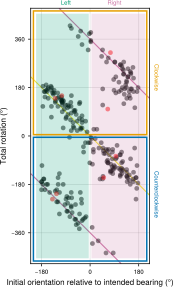
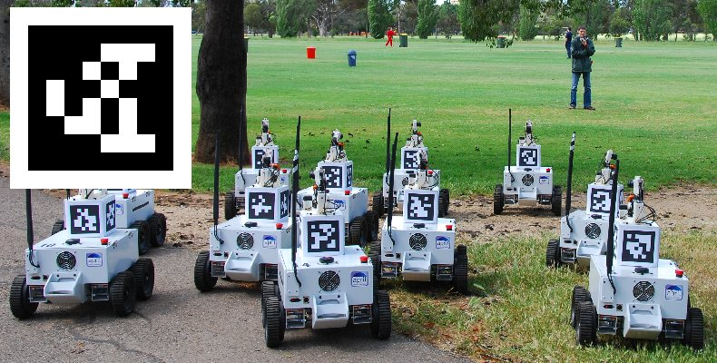

Integrating Software Engineering and Sensory Ecology: 
Tools for Understanding Animal Orientation

*Yakir Gagnon - Visionarium 2025*

<!--
Hi my name is Yakir, I work as a Research Software Engineer at Marie Dacke's lab at Lund University, Sweden. What is a research software engineer? I'm basically like a postdoc that never leaves. I build software and hardware for everyone in the lab, including experimental setups, statistical analysis, visualizations, and more...

I'd like to present what a RSE does and why that could be useful for PIs and students, and why you might want to become one.
-->

---
<!-- paginate: true -->

<video src="media/dance.mp4" autoplay muted width="100%" loop></video>

<!--
Dancing behavior. They scan their environment. Using the sun as a directional cue. The dance allows them to pan across the sky and register the direction of the sun relative to the ground. This was recorded by Elin Dirlik
-->

---

# How do they turn?

- Do they turn in random directions? 
- How much do they turn? 

<!-- footer: "Elin Dirlik" -->

---

<video src="media/repeated dances.mp4" autoplay muted width="100%" loop></video>

---

---

---

# Solar elevation
## How does it affect the dance?

- The sun has *zero* directional information when it's at the zenith

---

# Logit

 

---

# Physical relevance

 

---

<video src="media/dancingqueen.mp4" controls autoplay muted width="100%" loop></video>

<!-- footer: "Bastien Clémot" -->

<!--
This animation was made by Bestien in blender. He even made the screws... 
-->

---

---

<video src="media/mirror.mp4" autoplay muted width="100%" loop></video>

---

---

# Sky room

- Group brings back ~400 beetles per trip
- ~ 3 strudent, 3 PhDs, 2 postdocs = many behavioral experiments

<!-- footer: "" -->

---

# Others

- Sun moon tables
- Camera calibrations
- Autotracker
- Data analysis pipeline

---

# As a hiring PI

Pros:
- Broad spectrum of expertise
- Background lines of investigation
- Elevate the whole lab

Cons: 
- Costs money
- No formal/institutional way of paying/motivating for it

---

# As a career choice

Pros:
- no grant applications, articles to write, teaching
- build and play with "toys"

Cons: 
- no job security
- less pay than in the private industry

---

# The end

Thank you for listening
